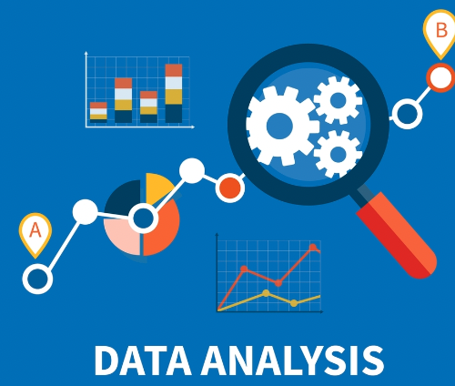

# Data Analysis

This repository contains a comprehensive data analysis of various datasets including car prices, diabetes, insurance, cancer and mental health. The analysis primarily focuses on performing linear regression, calculating correlation coefficients, and conducting statistical tests to gain insights into the relationships between attributes.

### Datasets
The following datasets were used for the analysis:

Car Prices Dataset: This dataset contains information about different car models, their attributes, and corresponding prices.

Diabetes Dataset: The diabetes dataset includes medical information about patients, their health attributes, and an indication of diabetes presence.

Mental Health Dataset: The mental health dataset encompasses survey responses related to mental health conditions, treatments, and demographics.
Insurance Dataset: The insurance dataset contains information on age, gender, race etc.

#### Analysis Steps
The analysis was conducted in the following steps:

#### Data Preprocessing: 
The datasets were thoroughly examined for missing values, outliers, and inconsistencies. Data cleaning techniques were applied to ensure data integrity.

#### Exploratory Data Analysis (EDA):
Exploratory techniques were employed to visualize the data distributions, and relationships between variables, and identify potential patterns or trends.

#### Linear Regression: 
Linear regression was performed to model the relationships between relevant attributes and the target variable (car prices, diabetes presence, mental health indicators). The coefficients of the regression equations were examined to understand the impact of each attribute on the target variable.

#### Correlation Coefficients: 
Correlation coefficients were calculated to quantify the strength and direction of linear relationships between pairs of attributes. This helps in identifying which attributes have a significant impact on the target variable.

#### Interpretation and Insights: 
The results of the analysis were interpreted to extract meaningful insights and conclusions about the relationships between attributes and the target variable in each dataset.

### Repository Structure
##### The repository is organized as follows:

data: This directory contains the raw datasets used for the analysis.
notebooks: Jupyter notebooks detailing the data analysis process step-by-step.
###### Jupyter notebooks contain:
figures: Plots, charts, and visualizations generated during the analysis.
results: Text files or summaries containing key findings, insights, and statistical outputs.

##### Usage
To replicate or extend this analysis, follow these steps:

Clone this repository: git clone https://github.com/yourusername/data-analysis-project.git
Navigate to the notebooks directory and open the relevant Jupyter notebook.
Follow the instructions within the notebook to load the datasets, perform analysis, and generate visualizations.
Refer to the generated figures and results for insights obtained from the analysis.
Dependencies

##### Acknowledgements:
We acknowledge the creators and contributors of the original datasets used in this analysis.
Please feel free to reach out to priyakhandelwal65@gmail.com for any questions, suggestions, or collaborations related to this analysis.

